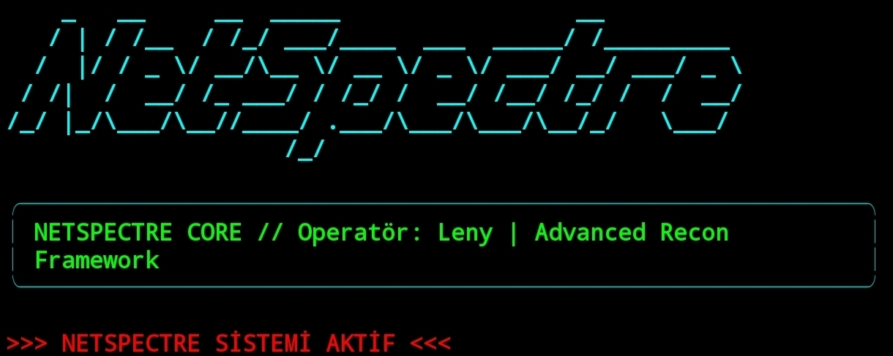

# NetSpectre // Advanced Reconnaissance Core

  

> "Information is the ultimate vector. If you can't see the target, you've already lost."

## 👁️ Operasyonel Amaç
NetSpectre; ağ katmanındaki anomalileri tespit etmek, açık yüzeyleri haritalandırmak ve hedef sistemin zayıf noktalarını saniyeler içinde raporlamak için tasarlanmış özel bir keşif (recon) çekirdeğidir.

---

## 📱 Termux Üzerinden Kurulum ve Çalıştırma

Eğer aracı Android (Termux) üzerinde hatasız çalıştırmak istiyorsan, terminale sırasıyla şu komutları yazman yeterlidir:

### 1. Sistem Paketlerini Güncelle ve Gereksinimleri Yükle
pkg update && pkg upgrade -y
pkg install python git -y

### 2. Repoyu Klonla ve Klasöre Gir
git clone https://github.com/leny-git/NetSpectre.git
cd NetSpectre

### 3. Gerekli Python Kütüphanelerini Kur
pip install -r requirements.txt

### 4. Aracı Başlat
python net_spectre.py

---

## ⚙️ Modül Mimarisi
- [x] **High-Speed TCP Vector Engine:** Agresif ve çoklu iş parçacıklı port haritalama.
- [x] **Service Fingerprinting (Banner Grabbing):** Hedef portun arkasındaki servis kimliklerini deşifre etme.

---
*Command & Control: Leny*
